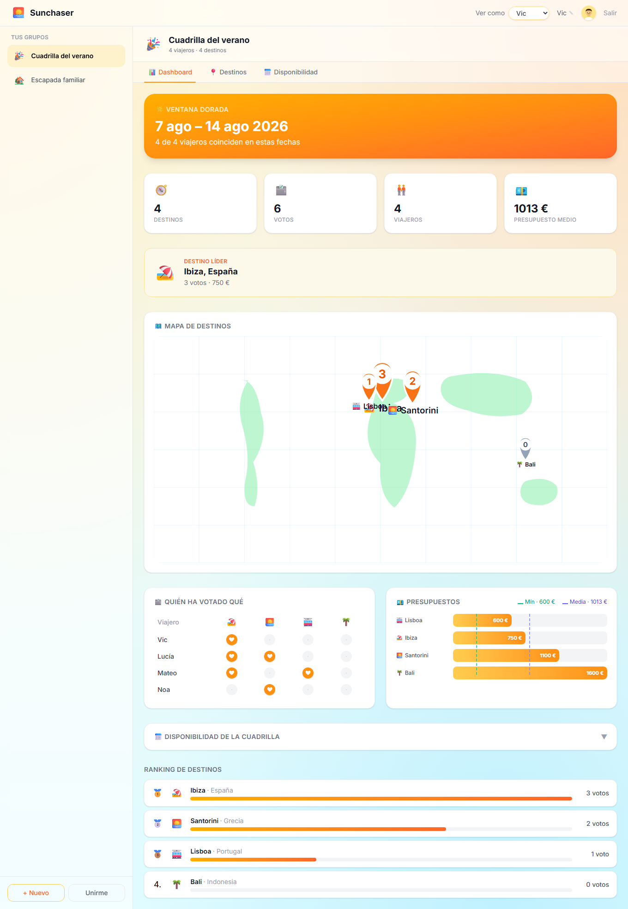
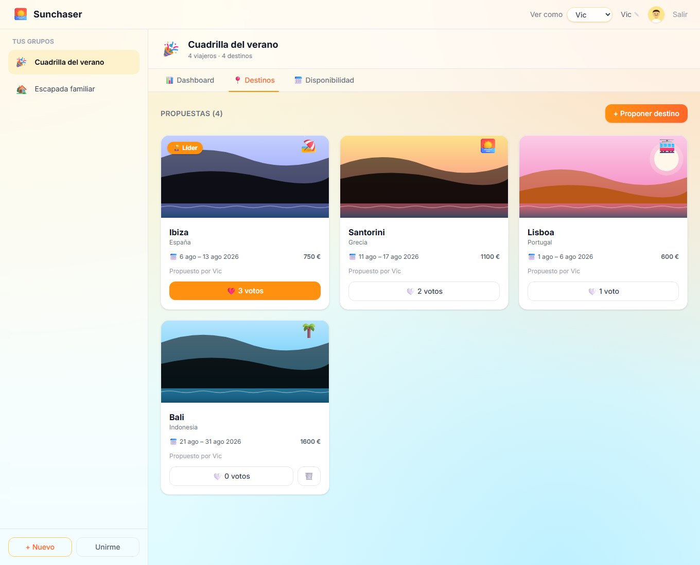
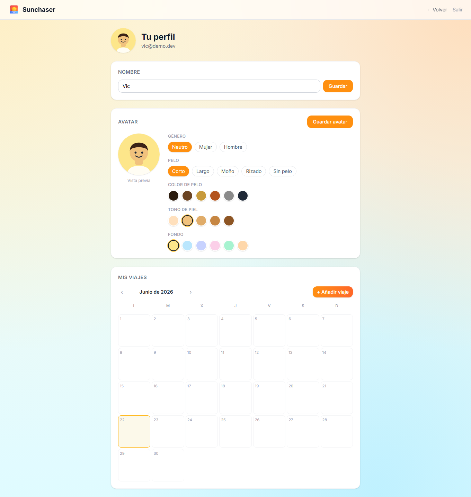

# 🌅 Sunchaser

**Plan your next summer escape with your crew — built on [Microsoft Fabric Apps](https://learn.microsoft.com/en-us/fabric/apps/) + [Rayfin](https://github.com/microsoft/rayfin).**

Sunchaser is a small, fun demo app that shows how far you can get with **zero
backend code**. You define your data model with TypeScript decorators, and
Rayfin provisions the database, authentication, data APIs, and hosting on
Microsoft Fabric for you.

A group of friends or family creates a **trip group**, proposes **destinations**,
**votes** on them, and declares their **availability**. A live **dashboard**
ranks the destinations and finds the *golden window* — the date range where the
most people are free. Everyone also gets a personal **profile** with a custom
avatar and a private trips calendar.


---

## Why the Rayfin CLI makes this so easy

The whole point of this demo: there is **no backend to write, host, or operate**.
The Rayfin CLI turns a few decorated TypeScript classes into a live, secured,
multi-tenant app on Microsoft Fabric. The entire lifecycle is three commands:

```bash
npm create @microsoft/rayfin@latest sunchaser   # 1. scaffold a typed full-stack app
npx rayfin login                                 # 2. sign in with your Entra ID
npx rayfin up                                    # 3. deploy DB + auth + APIs + hosting
```

That's it — `rayfin up` gives you back a live HTTPS URL. What you **don't** write:

| You'd normally hand-write… | With the Rayfin CLI you get it from… |
|----------------------------|--------------------------------------|
| SQL tables + migrations | A `@entity()` TypeScript class per table — `rayfin up` diffs & applies the schema |
| REST/GraphQL endpoints | A generated **typed client**: `client.data.Destination.select(...).where(...)` |
| Auth (login, tokens, sessions) | Built-in **Entra ID SSO** — `@authenticated()` on each entity |
| Row-level security rules | One-line **policies**: `policy: (claims, item) => claims.sub.eq(item.user_id)` |
| Servers, containers, TLS, scaling | Managed **Fabric hosting** — a static URL out of `rayfin up` |

Adding a brand-new feature is the same loop every time. The private trips
calendar in this app, for example, was a single new file:

```ts
// rayfin/data/Trip.ts — a fully private, per-user table in ~15 lines
@entity()
@authenticated('read',   { policy: (claims, item) => claims.sub.eq(item.user_id) })
@authenticated('create', { policy: (claims, item) => claims.sub.eq(item.user_id) })
@authenticated('update', { policy: (claims, item) => claims.sub.eq(item.user_id) })
@authenticated('delete', { policy: (claims, item) => claims.sub.eq(item.user_id) })
export class Trip {
  @uuid() id!: string;
  @text() user_id!: string;
  @text({ min: 1, max: 120 }) title!: string;
  @date() startDate!: Date;
  @date() endDate!: Date;
}
```

Register it in `schema.ts`, run `npx rayfin up`, and the table, its CRUD API and
its per-user isolation are live — no other backend changes. (Iterating on the UI?
`npm run demo` runs the whole thing offline against an in-memory store, so you
don't even need a Fabric account to build features.)

---

## Local run

No Fabric account needed — runs entirely in-memory with seed data:

```bash
npm install
npm run demo        # http://localhost:5173
```

Demo mode (`VITE_DEMO=1`) swaps the Fabric backend for an in-memory store, so you
can click through the whole app offline. It's also how the screenshots in
[`docs/`](docs/walkthrough.md) are produced.

The header has a **"Ver como"** switcher to experience the app as any of the four
seeded crew members (Vic, Lucía, Mateo, Noa) — each sees only their own groups,
votes and availability. To add more demo identities, append to `DEMO_CREW` in
[`src/services/demoClient.ts`](src/services/demoClient.ts) (and add matching
`GroupMember` seed rows so they belong to a group).

## Run against real Fabric

```bash
npx rayfin login                  # sign in with Entra ID
npm run dev                       # deploys the backend to Fabric, serves the UI locally
```

To deploy the whole app (frontend + schema) to your Fabric workspace:

```bash
npm run rayfin:up                 # == npx rayfin up
npx rayfin up status              # verify the deployment is healthy
```

See the full step-by-step (with screenshots) in
**[`docs/walkthrough.md`](docs/walkthrough.md)**.

### Highlights

- **Visual dashboard** — a world map with inverted-teardrop pins showing each
  destination's vote count, a "who voted what" poll matrix, a budget chart that
  marks the group average **and** minimum, and a collapsible availability Gantt
  with the *golden window* highlighted across everyone's ranges.

  

- **Procedural destination art** — every card renders a unique, deterministic
  SVG scene (sky, sun/moon, hills, water) generated purely from the destination
  name. No external image API, no network.

  

- **Personal profile** — set your name, build a simple emoji-style avatar
  (gender, hair, hair colour, skin tone, background) and manage a private,
  editable calendar of your own trips.

  

### Adding real users

On Fabric, sign-in is **Entra ID (Fabric SSO)** — "users" are real Microsoft
accounts in your tenant, not app records. To let more people use the deployed
app: create or invite them in the **Entra ID admin center** (Users → *New user* /
*Invite external user*) and give them access to the `fabric-apps` workspace. Each
person signs in with their own account and the row-level `@authenticated`
policies scope data by their `claims.sub`.

---

## Data model

Seven entities in [`rayfin/data/`](rayfin/data), each with explicit `@authenticated`
permissions and row-level policies. Reads are shared within a crew; writes are
scoped to the owning user — except `Trip`, which is **fully private** (even reads
are restricted to the owner).

```text
TripGroup ──< GroupMember        a user belongs to many groups
TripGroup ──< Destination ──< Vote
TripGroup ──< Availability       date ranges per user → golden window
Profile                          display name + avatar per user (claims.sub)
Trip                             private personal trips (per-user calendar)
```

| Entity | Purpose | Row-level rule |
|--------|---------|----------------|
| `TripGroup` | A crew (friends / family / couple) | Only the **owner** can rename/delete |
| `GroupMember` | User ↔ group membership | You manage **your own** membership |
| `Destination` | A proposed place in a group | Only the **proposer** can edit/delete |
| `Vote` | One vote per user per destination | You can only change **your own** vote |
| `Availability` | A free date range per user | You edit **your own** ranges |
| `Profile` | Your display name + avatar | You edit **your own** profile |
| `Trip` | Your personal trips calendar | **Private** — you read/write only your own |

Example — the whole authorization story for votes is just decorators:

```ts
@entity()
@authenticated('read')
@authenticated('create', { policy: (claims, item) => claims.sub.eq(item.user_id) })
@authenticated('update', { policy: (claims, item) => claims.sub.eq(item.user_id) })
@authenticated('delete', { policy: (claims, item) => claims.sub.eq(item.user_id) })
export class Vote {
  @uuid() id!: string;
  @uuid() group_id!: string;
  @uuid() destination_id!: string;
  @text() user_id!: string;
  @int() value!: number;
  @date() createdAt!: Date;
}
```

---

## Project structure

```text
├── rayfin/
│   ├── rayfin.yml              # Fabric services (auth, data=mssql, static hosting)
│   └── data/                   # The data model — one file per entity
│       ├── TripGroup.ts  GroupMember.ts  Destination.ts  Vote.ts
│       ├── Availability.ts  Profile.ts  Trip.ts
│       └── schema.ts           # Schema export consumed by the typed client
├── src/
│   ├── main.tsx · App.tsx      # Entry point + auth-gated routes (/, /profile)
│   ├── hooks/AuthContext.tsx   # React auth context
│   ├── components/             # AuthPage, GroupSidebar, GroupWorkspace, tabs
│   │   ├── charts/             # VoteMap, VotePoll, BudgetChart, AvailabilityGantt
│   │   ├── DestinationScene.tsx · Avatar.tsx · AvatarBuilder.tsx · TripsCalendar.tsx
│   ├── pages/                  # HomePage (app shell) · ProfilePage
│   ├── lib/                    # overlap.ts, presets.ts, geo.ts (map), avatar.ts
│   └── services/
│       ├── api.ts              # Typed data access (client.data.<Entity>)
│       ├── rayfinClient.ts     # Typed Rayfin client singleton
│       ├── bootstrap.ts        # Picks the auth service from env
│       ├── *AuthService.ts     # Fabric / Mock / Demo auth implementations
│       └── demoClient.ts       # In-memory backend for VITE_DEMO=1
├── scripts/                    # Playwright screenshot capture
└── docs/                       # Walkthrough + screenshots
```

## Scripts

| Command | Description |
|---------|-------------|
| `npm run demo` | Run the full app offline with seed data (`VITE_DEMO=1`) |
| `npm run dev` | Deploy backend to Fabric + run the local dev server |
| `npm run build` | Production build |
| `npm run lint` | Lint with ESLint |
| `npm run test` | Unit tests (golden-window + ranking logic) with Vitest |
| `npm run rayfin:up` | Deploy app + schema to Fabric |
| `npm run rayfin:db` | Apply schema migrations only |
| `npm run shots` | Regenerate screenshots with Playwright (needs `npm run demo` running) |

---

## How it works

- **Auth** — `bootstrap.ts` reads env vars and returns a Fabric, Mock, or Demo
  auth service. In Fabric, sign-in uses the brokered Entra flow; locally you get
  email/password; in demo mode you're always signed in.
- **Data** — every read/write goes through the typed client, e.g.
  `client.data.Destination.select([...]).where({ group_id: { eq } }).execute()`.
  No hand-written GraphQL, no `fetch`.
- **Golden window** — `lib/overlap.ts` sweeps everyone's availability ranges and
  returns the longest interval where the most distinct members overlap. Unit
  tested in `src/__tests__/overlap.test.ts`.

## License

MIT
