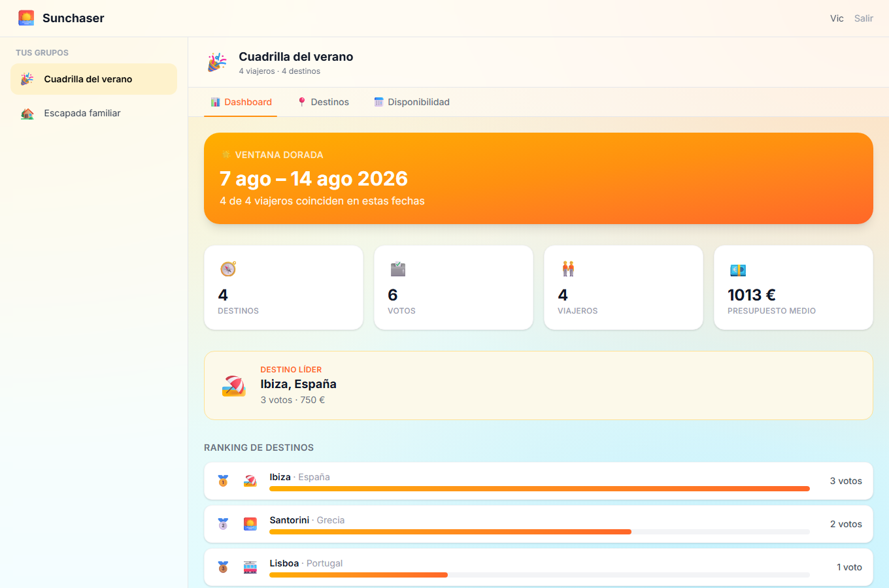

# 🌅 Sunchaser

**Plan your next summer escape with your crew — built on [Microsoft Fabric Apps](https://learn.microsoft.com/en-us/fabric/apps/) + [Rayfin](https://github.com/microsoft/rayfin).**

Sunchaser is a small, fun demo app that shows how far you can get with **zero
backend code**. You define your data model with TypeScript decorators, and
Rayfin provisions the database, authentication, data APIs, and hosting on
Microsoft Fabric for you.

A group of friends or family creates a **trip group**, proposes **destinations**,
**votes** on them, and declares their **availability**. A live **dashboard**
ranks the destinations and finds the *golden window* — the date range where the
most people are free.



---

## Why this is a good Fabric Apps demo

| Fabric Apps strength | How Sunchaser shows it |
|----------------------|------------------------|
| **Rapid prototyping** | From `npm create` to a deployed URL in minutes — no infra to manage. |
| **Auth without boilerplate** | Sign-in is Fabric SSO (Entra ID). No auth servers, no token plumbing. |
| **Row-level security** | You can only edit *your own* votes, availability, and proposals — enforced in the data model, not the UI. |
| **Data exploration & viz** | The dashboard queries Fabric data through the typed GraphQL client and renders a live ranking + overlap. |
| **Visual & delightful** | Summer theme, destination cards, emojis, golden-window hero. |

> Fabric Apps is **not** meant for complex multi-step transactions/stored
> procedures or custom auth providers beyond Fabric SSO and email/password.
> Sunchaser intentionally stays inside those lines.

---

## Try it in 60 seconds (offline demo mode)

No Fabric account needed — runs entirely in-memory with seed data:

```bash
npm install
npm run demo        # http://localhost:5173
```

Demo mode (`VITE_DEMO=1`) swaps the Fabric backend for an in-memory store and a
fixed signed-in user, so you can click through the whole app offline. It's also
how the screenshots in [`docs/`](docs/walkthrough.md) are produced.

## Run against real Fabric

```bash
npx rayfin login                  # sign in with Entra ID
npm run dev                       # deploys the backend to Fabric, serves the UI locally
```

To deploy the whole app (frontend + schema) to your Fabric workspace:

```bash
npm run rayfin:up                 # == npx rayfin up
npx rayfin up status              # verify the deployment is healthy
```

See the full step-by-step (with screenshots) in
**[`docs/walkthrough.md`](docs/walkthrough.md)**.

---

## Data model

Five entities in [`rayfin/data/`](rayfin/data), each with explicit `@authenticated`
permissions and row-level policies. Reads are shared within a crew; writes are
scoped to the owning user.

```text
TripGroup ──< GroupMember        a user belongs to many groups
TripGroup ──< Destination ──< Vote
TripGroup ──< Availability       date ranges per user → golden window
```

| Entity | Purpose | Row-level rule |
|--------|---------|----------------|
| `TripGroup` | A crew (friends / family / couple) | Only the **owner** can rename/delete |
| `GroupMember` | User ↔ group membership | You manage **your own** membership |
| `Destination` | A proposed place in a group | Only the **proposer** can edit/delete |
| `Vote` | One vote per user per destination | You can only change **your own** vote |
| `Availability` | A free date range per user | You edit **your own** ranges |

Example — the whole authorization story for votes is just decorators:

```ts
@entity()
@authenticated('read')
@authenticated('create', { policy: (claims, item) => claims.sub.eq(item.user_id) })
@authenticated('update', { policy: (claims, item) => claims.sub.eq(item.user_id) })
@authenticated('delete', { policy: (claims, item) => claims.sub.eq(item.user_id) })
export class Vote {
  @uuid() id!: string;
  @uuid() group_id!: string;
  @uuid() destination_id!: string;
  @text() user_id!: string;
  @int() value!: number;
  @date() createdAt!: Date;
}
```

---

## Project structure

```text
├── rayfin/
│   ├── rayfin.yml              # Fabric services (auth, data=mssql, static hosting)
│   └── data/                   # The data model — one file per entity
│       ├── TripGroup.ts  GroupMember.ts  Destination.ts  Vote.ts  Availability.ts
│       └── schema.ts           # Schema export consumed by the typed client
├── src/
│   ├── main.tsx · App.tsx      # Entry point + auth-gated routes
│   ├── hooks/AuthContext.tsx   # React auth context
│   ├── components/             # AuthPage, GroupSidebar, GroupWorkspace, tabs
│   ├── pages/HomePage.tsx      # App shell (sidebar + workspace)
│   ├── lib/                    # overlap.ts (golden window + ranking), presets.ts
│   └── services/
│       ├── api.ts              # Typed data access (client.data.<Entity>)
│       ├── rayfinClient.ts     # Typed Rayfin client singleton
│       ├── bootstrap.ts        # Picks the auth service from env
│       ├── *AuthService.ts     # Fabric / Mock / Demo auth implementations
│       └── demoClient.ts       # In-memory backend for VITE_DEMO=1
├── scripts/                    # Playwright screenshot capture
└── docs/                       # Walkthrough + screenshots
```

## Scripts

| Command | Description |
|---------|-------------|
| `npm run demo` | Run the full app offline with seed data (`VITE_DEMO=1`) |
| `npm run dev` | Deploy backend to Fabric + run the local dev server |
| `npm run build` | Production build |
| `npm run lint` | Lint with ESLint |
| `npm run test` | Unit tests (golden-window + ranking logic) with Vitest |
| `npm run rayfin:up` | Deploy app + schema to Fabric |
| `npm run rayfin:db` | Apply schema migrations only |
| `npm run shots` | Regenerate screenshots with Playwright (needs `npm run demo` running) |

---

## How it works

- **Auth** — `bootstrap.ts` reads env vars and returns a Fabric, Mock, or Demo
  auth service. In Fabric, sign-in uses the brokered Entra flow; locally you get
  email/password; in demo mode you're always signed in.
- **Data** — every read/write goes through the typed client, e.g.
  `client.data.Destination.select([...]).where({ group_id: { eq } }).execute()`.
  No hand-written GraphQL, no `fetch`.
- **Golden window** — `lib/overlap.ts` sweeps everyone's availability ranges and
  returns the longest interval where the most distinct members overlap. Unit
  tested in `src/__tests__/overlap.test.ts`.

## License

MIT
