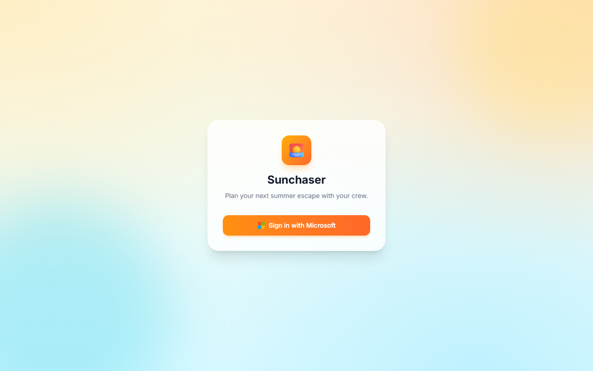
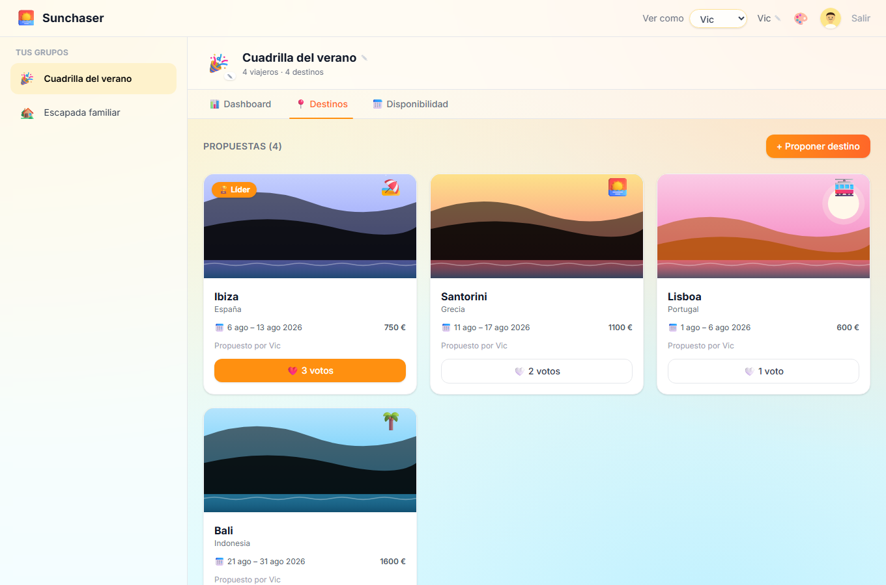
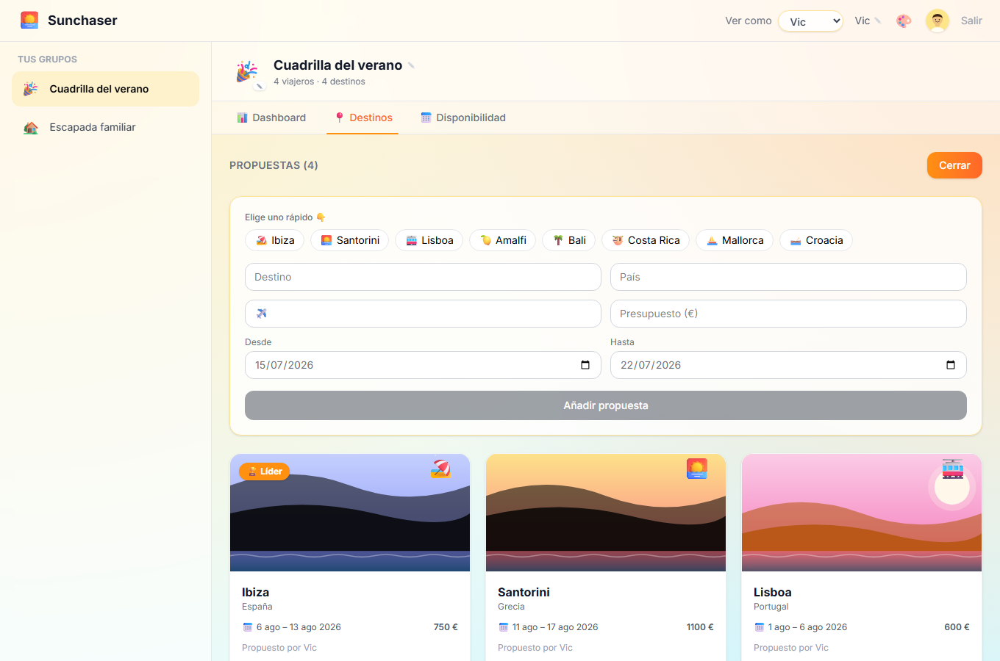
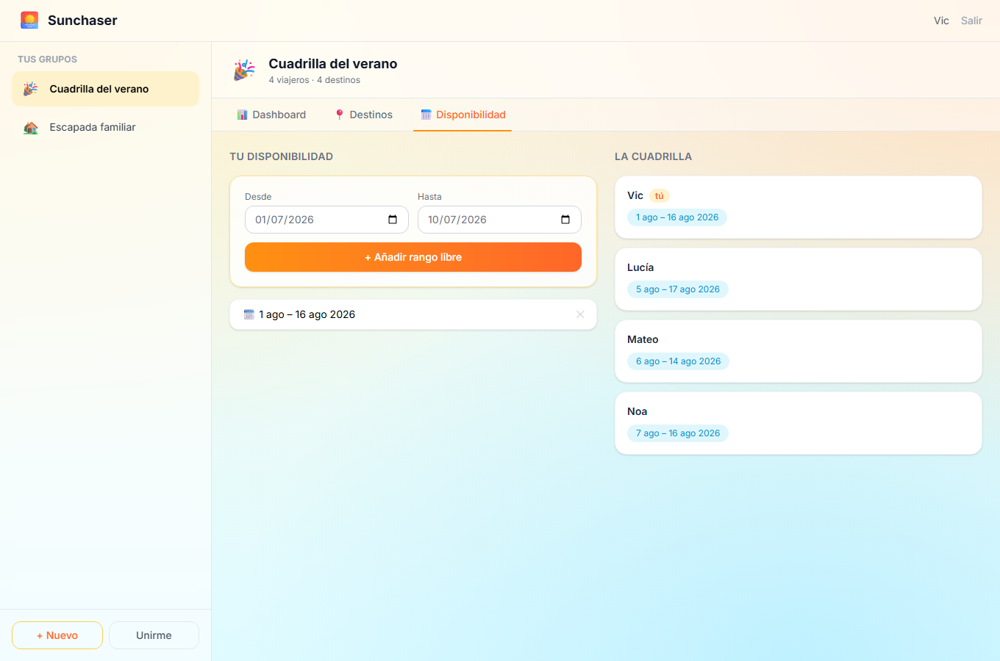
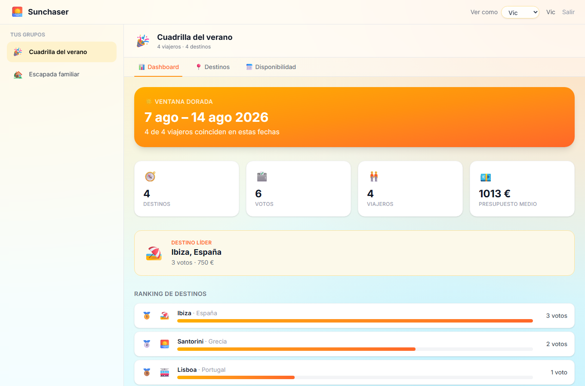
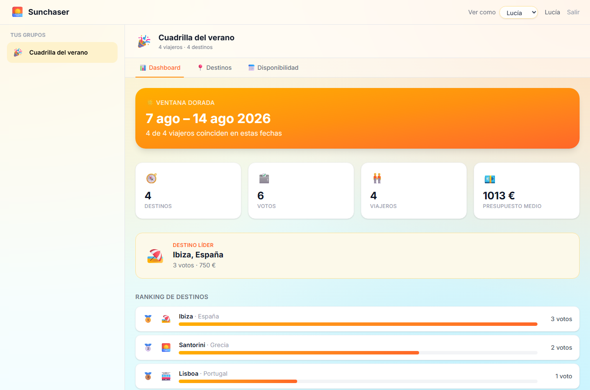
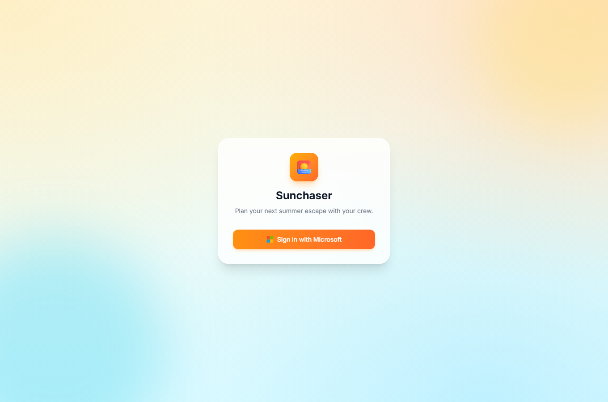

# Sunchaser — step-by-step walkthrough

This walkthrough mirrors the official tutorial
[*Create and deploy your first Fabric app with the Rayfin CLI*](https://learn.microsoft.com/en-us/fabric/apps/create-app-with-cli),
applied to Sunchaser. It covers scaffolding, the data model, the UI, and a real
deployment to Microsoft Fabric.

> 💡 All the in-app screenshots below were captured automatically with Playwright
> against **demo mode** (`npm run demo`). Regenerate them anytime with
> `npm run shots`.

---

## 0. Prerequisites

- Node.js and npm
- Access to Microsoft Fabric with a workspace where you are Contributor/Member/Admin
- The **Fabric Apps (preview)** workload enabled in your tenant
  (Admin portal → *Tenant settings* → search **Fabric Apps** → enable → *Apply*).
  Without it, `rayfin up` returns `403 Forbidden — The feature is not available`.

---

## 1. Scaffold the project

```bash
npx rayfin login        # one-time, opens the browser for Entra sign-in
npm create @microsoft/rayfin@latest -- sunchaser \
  --project-name sunchaser -t todoapp --workspace fabric-apps
cd sunchaser
```

We started from the `todoapp` template (it already wires Fabric auth + a typed
data path) and reshaped it into Sunchaser.

## 2. Model the data

Five entities live in [`rayfin/data/`](../rayfin/data). Each gets explicit
`@authenticated` permissions. Reads are shared within a crew; writes are pinned
to the owning user with a row-level `policy`.

```ts
// rayfin/data/Destination.ts
@entity()
@authenticated('read')
@authenticated('create', { policy: (c, i) => c.sub.eq(i.proposedBy) })
@authenticated('update', { policy: (c, i) => c.sub.eq(i.proposedBy) })
@authenticated('delete', { policy: (c, i) => c.sub.eq(i.proposedBy) })
export class Destination {
  @uuid() id!: string;
  @uuid() group_id!: string;
  @text({ min: 1, max: 80 }) name!: string;
  @text({ max: 60 }) country!: string;
  @int() estimatedBudget!: number;
  @date() suggestedStart!: Date;
  // …
}
```

Key rules we followed (from the project's installed Rayfin docs):

- Every field has exactly one decorator; `@text` always sets `max` (MSSQL).
- FK-style columns (`group_id`, `destination_id`) are `@uuid`; auth user ids
  (`user_id`, `proposedBy`) are `@text`, since they come from `claims.sub`.
- Each entity is registered in [`rayfin/data/schema.ts`](../rayfin/data/schema.ts).

## 3. Build the UI

A typed client call is all it takes to read data — no GraphQL by hand:

```ts
// src/services/api.ts
const rows = await client.data.Destination
  .select(['id', 'name', 'country', 'estimatedBudget', /* … */])
  .where({ group_id: { eq: groupId } })
  .orderBy({ createdAt: 'desc' })
  .execute();
```

The React app (Vite + React 19 + Tailwind v4) is a sidebar of groups plus a
workspace with three tabs.

### Sign in

Fabric SSO — one button, no auth code.



### Dashboard

Live destination ranking and the **golden window** (the date span where the most
crew members overlap), computed in [`src/lib/overlap.ts`](../src/lib/overlap.ts).


### Destinations & voting

Propose a place (one-click presets), then vote. The leader is highlighted.





### Availability

Everyone marks the date ranges they're free; the dashboard overlaps them.



### Try it as different users (demo mode)

In demo mode the header shows a **"Ver como"** switcher so you can experience the
app as any crew member without real sign-in — each identity sees only their own
groups, votes and availability (row-level security in action). Switching to
**Lucía**, for example, hides the *Escapada familiar* group she doesn't belong to.





> 🔁 Regenerate these with `node scripts/shoot-switcher.mjs` (demo server running).

## 4. Validate locally

```bash
npm run lint     # ESLint
npm run test     # Vitest — golden-window + ranking unit tests
npm run demo     # click through the whole app offline
```

## 5. Deploy to Fabric

`rayfin up` builds the static frontend, deploys it, **and** applies pending
schema migrations in one step:

```bash
npm run rayfin:up        # == npx rayfin up
npx rayfin up status     # verify health
```

On success the CLI prints the hosted app URL and the Fabric portal link, and
records deployment metadata in `rayfin/.deployments.json` (git-ignored).

The deployed app authenticates with Entra ID — here is the live Fabric
deployment's sign-in screen:



See [`fabric-deploy.md`](fabric-deploy.md) for the live deployment log and the
Fabric deployment details from this project.

## 6. Iterate

Change an entity or the UI and run `npm run rayfin:up` again. For schema-only
changes you can use `npx rayfin up db apply`. Destructive changes (drop column,
change type) require `--force` — review carefully.

---

## Architecture at a glance

```text
  Browser (React + Vite, hosted on Fabric)
        │  typed client  (client.data.<Entity>, client.auth)
        ▼
  Rayfin services on Microsoft Fabric
   ├── Auth         → Entra ID (Fabric SSO)
   ├── Data API     → Data API Builder (GraphQL) over MSSQL
   └── Static host  → the built frontend
        │
        ▼
  Row-level security compiled from @authenticated(policy: …) decorators
```
